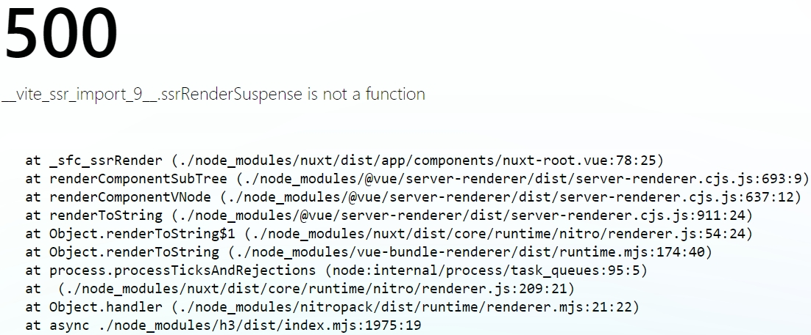

# nuxt3 + sentry8.13 build error example
This is project to help reproduce issue related to sentry-node package causing build error for nuxt 3 in development 
mode without `globalThis._sentryEsmLoaderHookRegistered = true` hack.

### How to reproduce 
0) Set your env variables `cp .env.dist .env`
1) Start the app (`docker-compose build && docker-compose up`)
2) Open in browser [http://localhost:3000/](http://localhost:3000/)
3) You should see the error in terminal and your browser




### Quick fix
1) Uncomment line 18 in `src/server/plugins/sentry.ts` (`globalThis._sentryEsmLoaderHookRegistered = true`)
2) Rebuild app (`docker-compose build && docker-compose up`)
3) Check your browser, now it should work

### Notes
1) The app works fine if development mode is `production` (set env variable and rebuild the app)
2) In another nuxt3+sentry8.13 project that I can't share with about the same code causes another error:
```
   2024-06-29T09:21:29.842333094Z [0] error occured The requested module 'vue' does not provide an export named 'computed'
   2024-06-29T09:21:29.842333094Z [0]
   2024-06-29T09:21:29.842336090Z [0]   import { getCurrentInstance, inject, onUnmounted, onDeactivated, onActivated, computed, unref, watchEffect, defineComponent, reactive, h, provide, ref, watch, shallowRef, shallowReactive, nextTick } from 'vue';
   2024-06-29T09:21:29.842337828Z [0]   ^^^^^^^^
   2024-06-29T09:21:29.842339123Z [0]   SyntaxError: The requested module 'vue' does not provide an export named 'computed'
   2024-06-29T09:21:29.842340460Z [0]   at ModuleJob._instantiate (node:internal/modules/esm/module_job:131:21)
   2024-06-29T09:21:29.842341866Z [0]   at async ModuleJob.run (node:internal/modules/esm/module_job:213:5)
   2024-06-29T09:21:29.842343093Z [0]   at async ModuleLoader.import (node:internal/modules/esm/loader:316:24)
   2024-06-29T09:21:29.842344353Z [0]   at async ViteNodeRunner.interopedImport (node_modules/vite-node/dist/client.mjs:383:28)
   2024-06-29T09:21:29.842353235Z [0]   at async ViteNodeRunner.directRequest (node_modules/vite-node/dist/client.mjs:253:24)
   2024-06-29T09:21:29.842354965Z [0]   at async ViteNodeRunner.cachedRequest (node_modules/vite-node/dist/client.mjs:189:14)
   2024-06-29T09:21:29.842356253Z [0]   at async ViteNodeRunner.dependencyRequest (node_modules/vite-node/dist/client.mjs:233:12)
   2024-06-29T09:21:29.842357491Z [0]   at async virtual:nuxt:/usr/src/frontend/app/.nuxt/vue-router-stub.mjs:1:31
   2024-06-29T09:21:29.842358866Z [0]   at async ViteNodeRunner.runModule (node_modules/vite-node/dist/client.mjs:362:5)
   2024-06-29T09:21:29.842360180Z [0]   at async ViteNodeRunner.directRequest (node_modules/vite-node/dist/client.mjs:346:5)
```
P.S. the same fix works there as well...